# Noise measurement for Differential Common-Emitter from R&T BiCMOS Run1 HBT pairs

*Prepared by Bao TON - APC*

-----------------------------------------------

Results obtained from the measurement from 3 PCB boards of Differential Common-Emitter Amplifier 

## 1. Measuremnt Setup: 

### 1.1. Instrument:

* +- 2.5V Power Supply (Resulting +-1.65V by the regulator)
* Signal was amplified by Stanford Research SR560 by a factor of 1000
* Vector Analyser 89410A 

### 1.2. Test board: 

<figure>
  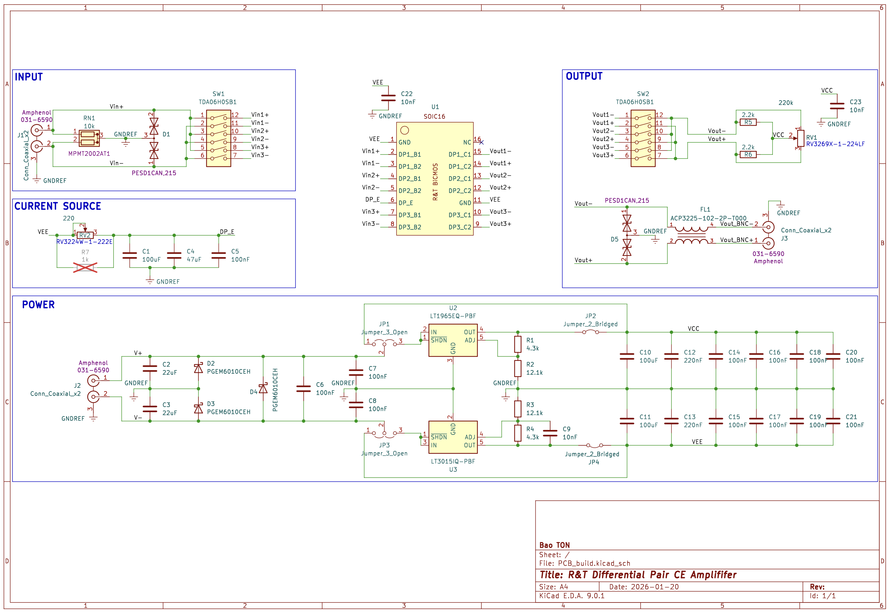
  <figcaption>Schematic of the Test PCB.</figcaption>
</figure>
<figure>
  
  <figcaption>3D view of the Test PCB</figcaption>
</figure>

### 1.3. Measurement description

The main objective of the measurement is to measure the **input referred noise** of the differential amplifier. 

There will be 3 differential pair on the same ASIC (R&T BiCMOS run 1) with input/output control by 2 analog switch.

Anyway, there is some improvement on the PCB board that we're expected to see: 

* Voltage Regulator was implemented in term of reducing the noise from power supply. 
* Two potentiometer was implemented: 

    1. Parallel with Load resistor to generate the **mismatch** of interest.

    2. Parallel with Resistive bias ($R_e$) to adjust the bias current.
* A LPF with fc down to 1 Hz was implemented in biasing stage in order to reduce common-mode noise adding from this stage into the amplifier.

## 2. Results

### 2.1. Noise measure from the SR560

<figure>
  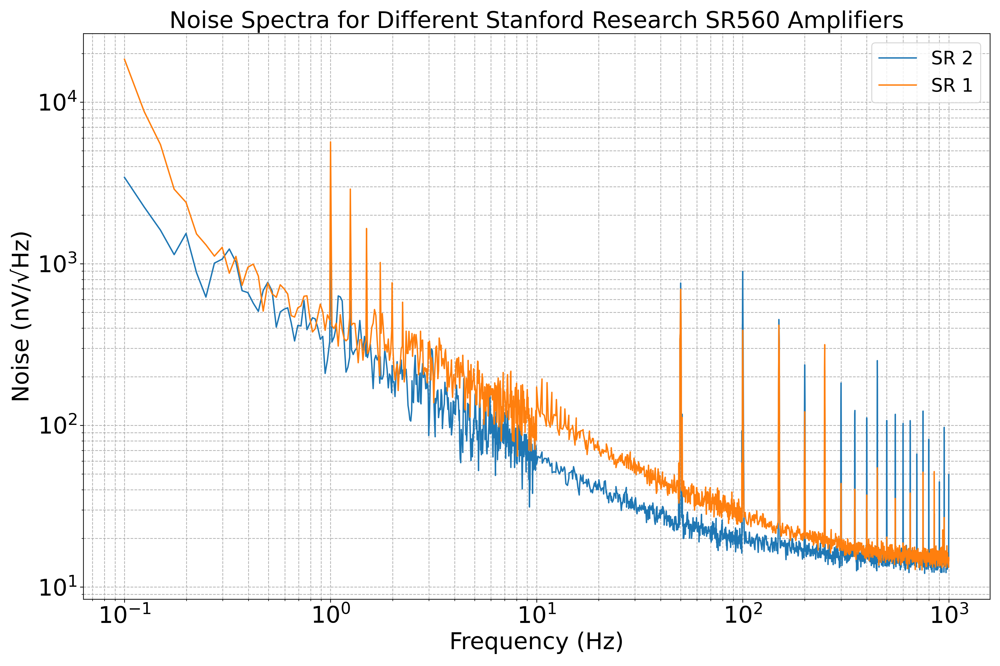
  <figcaption>Noise density of SR560 Pre-Amplifier</figcaption>
</figure>

### 2.2. Noise measurement 

#### 2.2.1. General Input noise measurement for each PCB 

In this measurement:

* Potentiometer adjusted to be in the middle of the track, proving $R_{C1} = R_{C2} = 2150 \Omega$
* Circuit bias with $I_{EE} = 1k \Omega$
* Gain of Stanford Research setted at 1000

Raw data measurement (overplot with instrument noise)

<figure>
  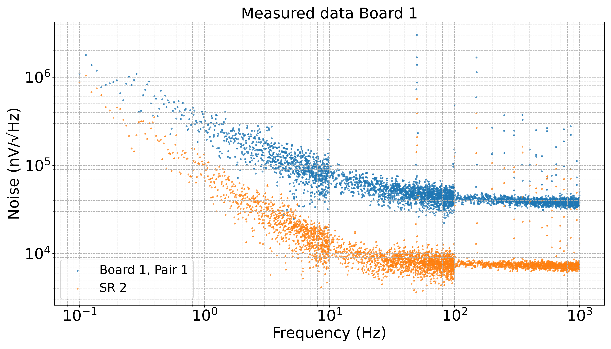
  <figcaption>Noise density of Board 1</figcaption>
</figure>

<figure>
  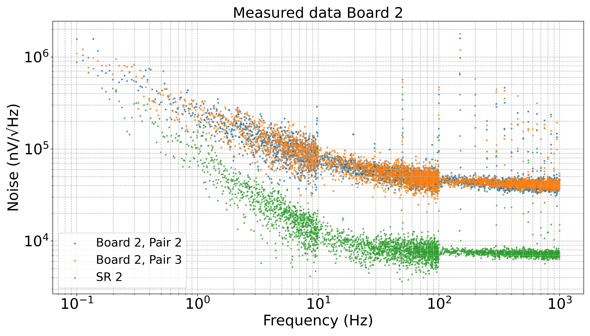
  <figcaption>Noise density of Board 2</figcaption>
</figure>

<figure>
  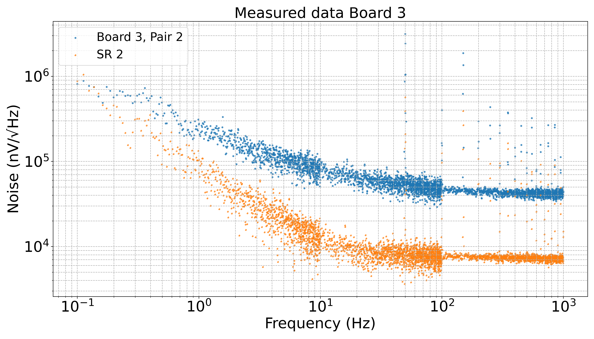
  <figcaption>Noise density of Board 3</figcaption>
</figure>

We now show the cleaned spectrum (by subtracting the noise floor), apply a fit, divide by the differential gain and overplot with a post-layout simulation result.

<figure>
  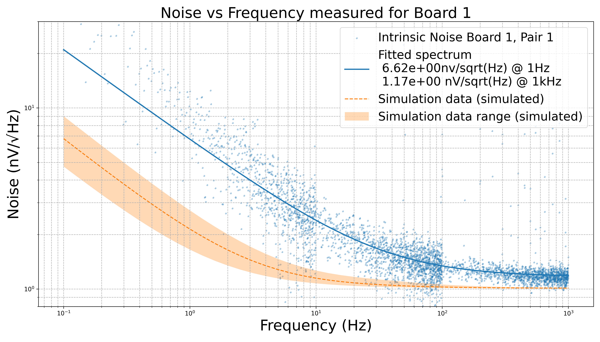
  <figcaption>Input referred noise measured Board 1</figcaption>
</figure>

<figure>
  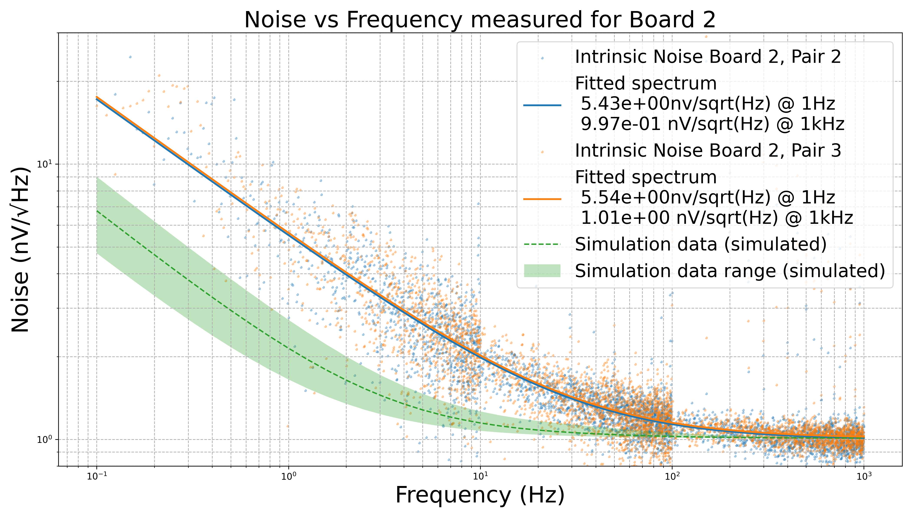
  <figcaption>Input referred noise measured Board 2</figcaption>
</figure>

<figure>
  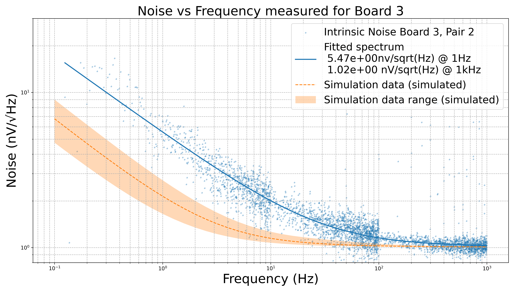
  <figcaption>Input referred noise measured Board 3</figcaption>
</figure>

#### 2.2.2. Input noise's variation due to mismatch
For this measurement, we adjust the potentiometer in between two load resistors in order to introduce mismatch. The results divide by 2 section

* Measurement while keeping the cutoff frequency near 1Hz for LPF at emitter, mismatch increase from 0 to 5 %

<figure>
  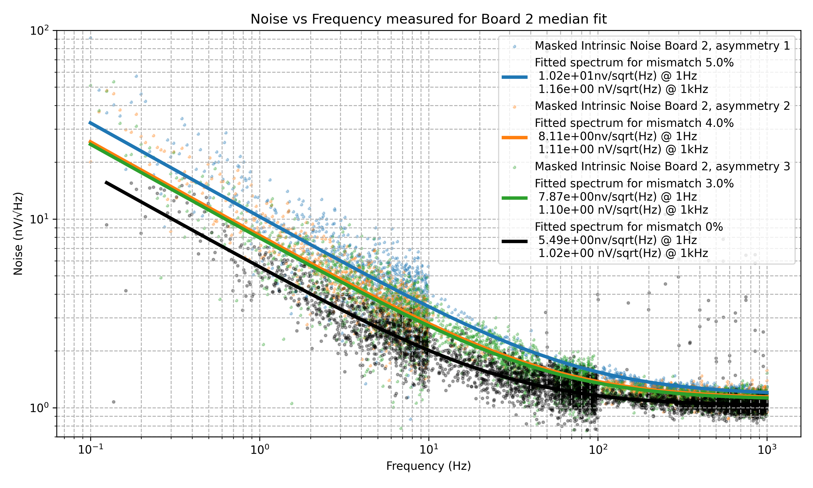
  <figcaption>Mismatch=induced Input referred noise measured Board 2 (with LPF) </figcaption>
</figure>

* Measurement while removing LPF at emitter, mismatch increase from 0 to 15 %, in comparison with post-layout simulation 

<figure>
  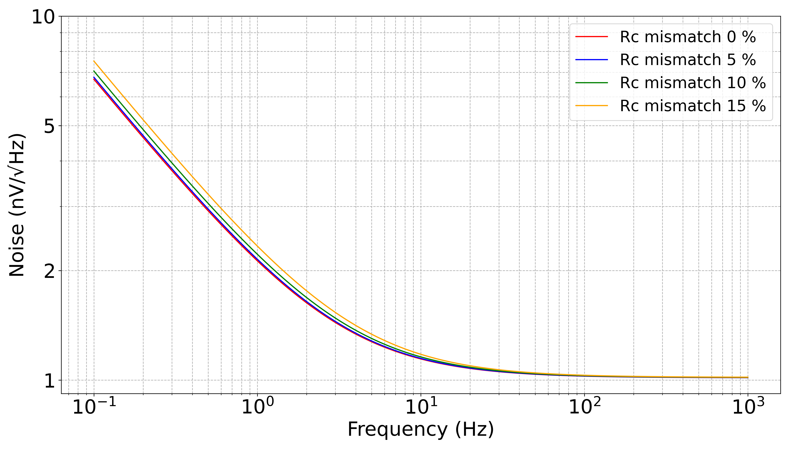
  <figcaption>Mismatch=induced Input referred noise measured Board 2 (simu) </figcaption>
</figure>

<figure>
  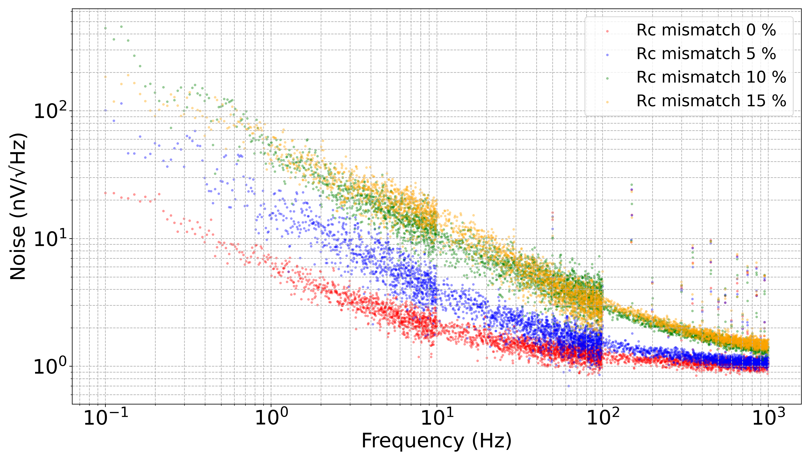
  <figcaption>Mismatch-induced Input referred noise measured Board 2 (measure) </figcaption>
</figure>

<!-- The purpose of this measurement is to characterize the Heterojunction Bipolar Transistor (HBT) from IHP.

The test circuit consists of 6 groups of transistors, with each group containing 40 transistors in parallel. Each transistor has an emitter length ($E_l$) of $40 \mu m$. The circuit, designed by Jean Mesquida (APC), is part of the R&T BiCMOS project ASIC, which was taped out in November 2024. The test board was provided by Bao TON (APC). -->

# Next plan 

1. Review remain functional pair in each board 
2. Do the mismatch measurement on other boards (other from board 3)
3. Change IEE, measure the noise of all board 
4. Cryogenic measurement? 
# Aknowledgement 

ASICs and Measurement was done due to the contribution of **R&T BiCMOS** multi-wafer project and **Laboratory
of Astroparticles and Cosmology (APC)**